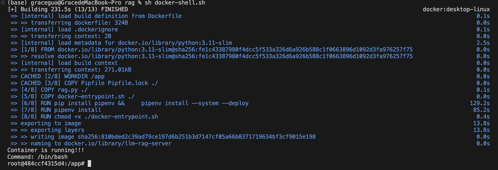
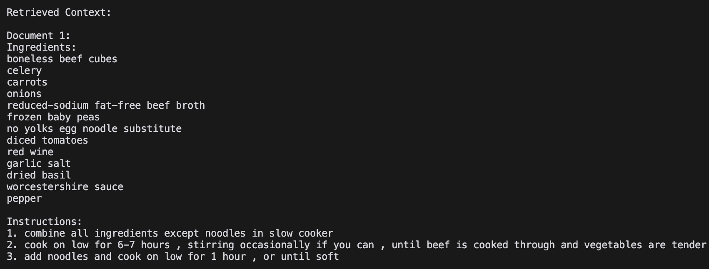

# ByteBites: Recipe Generation

## Project Info
In our project, we aim to develop a web application that integrates LLMs with Nutritional Science and provides a user-friendly interface to personalize recipe suggestions based on available ingredients while providing nutritional insights for the user. 

### Team Members
| Name         | GitHub Profile                   |
|--------------|----------------------------------|
| Grace Guo     | [@gguo78](https://github.com/gguo78) |
| Yilin Qi       | [@yilinnq](https://github.com/yilinnq) |
| Xu Tang   | [@xut806](https://github.com/xut806) |


## Directory Structure

Our repo is structured as follows:

```
├── reports/                 # Application mock-up and interactive prototype
│    ├── AC215_webapp_prototype.pdf      
│    ├── Midterm_Presentation.pdf   # [New in MS3] Presentation slides PDF version
│    ├── Midterm_Presentation.pptx   # [New in MS3] Presentation slides PPTX version  
│    └── prototype_link.md
├── src/                     # Source code directory
│    ├── ocr/                # [New in MS3] Implementing OCR and NER for ingredient recognition from receipt
│         ├── ocr_ner.py   
│         ├── extract_ingredients.py 
│         ├── docker-shell.sh   
│         ├── docker-entrypoint.sh  
│         ├── Dockerfile   
│         ├── Pipfile   
│         └── Pipfile.lock
│         
│    ├── preprocessing/       #  Preprocessing raw recipe data from a Google Cloud Storage bucket and prepare it for fine-tuning.        
│         ├── data_preprocessing.py    
│         ├── docker-shell.sh   
│         ├── docker-entrypoint.sh  
│         ├── Dockerfile   
│         ├── Pipfile   
│         └── Pipfile.lock
│
│    ├── fine-tuning/             # Fine-tuning LLM using the preprocessed recipe data.
|         ├── inference+nutrition.py  # Please run this script to get the generated recipe and the nutrition facts   
│         ├── utils.py   
│         ├── fine_tune.py    
│         ├── compare_models.py   
│         ├── docker-shell.sh   
│         ├── docker-entrypoint.sh  
│         ├── Dockerfile   
│         ├── Pipfile   
│         └── Pipfile.lock
│
│    ├── rag/                     # Implementing RAG workflow for generating recipes based on user queries
│         ├── rag.py   
│         ├── docker-shell.sh   
│         ├── docker-entrypoint.sh  
│         ├── Dockerfile   
│         ├── Pipfile   
│         └── Pipfile.lock
│    └── .env
├── .gitignore
├── README.md
├── LICENSE
├── secrets/                      # Secrets directory
│    └── recipe.json
```

Please make sure to create an `.env` file that contains your Huggingface Access Token (`HUGGINGFACE_TOKEN`) and your USDA API key (`USDA_API_KEY`) as well as a `secrets/` directory with your credentials in the location as shown above after cloning the repo.


## Table of Contents
1. [Virtual Environment Setup & Containers](#virtual-environment-setup--containers)
2. [Data Versioning Strategy](#data-versioning-strategy)
3. [LLM: Fine-tuning](#llm-fine-tuning)
4. [LLM: RAG](#llm-rag)


## Virtual Environment Setup & Containers

We have three containers for this project and each container serves a specific purpose within the project, including data preprocessing, fine-tuning, and RAG (Retrieval-Augmented Generation).

### Container 1: OCR & NER (NEW IN MS3)

- **Purpose**: To recognize text from receipt images (OCR) and then recognize edible ingredients (NER).

- **Files**:
  - `Dockerfile`: Defines the environment and dependencies for ocr and ner processing.
  - `Pipfile`: Manages Python packages.
  - `ocr_ner.py`/`extract_ingredients.py`: Two scripts serve the same function and contain the OCR & NER logic. The pre-trained OCR package, `docTR`, is used for text recognition from receipt images, whereas the pre-trained NER model specific to food entities, `InstaFoodRoBERTa-NER` is used for NER. We uploaded the [ExpressExpense](https://expressexpense.com/blog/free-receipt-images-ocr-machine-learning-dataset/) dataset, which is a set of 200 receipt images, to a GCS bucket; this script downloads the data from the GCS bucket and then conducts OCR and NER. It uploads the recognized ingredients as a .json file to the GCS bucket.
  - `docker-entrypoint.sh`: Entry point script for the container.

- **Instructions**:
  - In the `/ocr` directory, run `sh docker-shell.sh` to start the container.
  - Once the container is running, run `python ocr_ner.py` or `python extract_ingredients.py` to start the OCR & NER processing.

### Container 2: Data Preprocessing

- **Purpose**: To process raw recipe data from a Google Cloud Storage bucket and prepare it for fine-tuning and rag tasks. 

- **Files**:
  - `Dockerfile`: Defines the environment and dependencies for data preprocessing.
  - `Pipfile`: Manages Python packages.
  - `data_preprocessing.py`: Contains the preprocessing logic, where we fetch the data from the Google Cloud Storage bucket and upload the processed data to Google Cloud Storage for the next container.
  - `docker-entrypoint.sh`: Entry point script for the container.

- **Instructions**: 
  - In the `/preprocessing` directory, run `sh docker-shell.sh` to start the container.
  - Once the container is running, run `python data_preprocessing.py` to start the data preprocessing.

- **Screenshot**: 

   

### Container 3: Fine-Tuning

- **Purpose**: To fine-tune the language model using the preprocessed recipe data.

- **Files**:
  - `Dockerfile`: Sets up the environment for fine-tuning.
  - `Pipfile`: Manages Python packages.
  - `fine_tune.py`: Contains the fine-tuning logic.
  - `utils.py`: Contains the utility functions for fine-tuning.
  - `upload.py`: Upload the model.safetensors file of the finetuned model to GCP bucket.
  - `docker-entrypoint.sh`: Entry point script for the container.
  - **`inference+nutrition.py`**: Loads the finetuned model using the `model.safetensors` file from the `finetuned_model/` folder on our GCP bucket, generates a recipe with our finetuned model, and obtains the nutrition fact of the recipe by calling the USDA API. The generated recipe is uploaded to the `generated_recipe/` folder on our GCP bucket, and the nutrition facts is uploaded to the `nutrition_facts/` folder on our GCP bucket.
  - `compare_models.py`: Contains the logic to load the finetuned model from the `model.safetensors` file from the GCP bucket, then compare the performance of the fine-tuned model with the base model.

- **Instructions**:
  - In the `/fine-tuning` directory, run `sh docker-shell.sh` to start the container.
  - Once the container is running, run `python fine_tune.py` to start the fine-tuning. You may choose not to run this step, because we have already fine-tuned and copied the model to the container. (However, due to the size of the model, we did not push it to Github.)
  - You can run `python compare_models.py` to compare the performance of the fine-tuned model with the base model.

- **Screenshot**: 

     

### Container 4: RAG (Retrieval-Augmented Generation)

- **Purpose**: To implement the RAG workflow for generating recipes based on user queries.

- **Files**:
  - Dockerfile: Defines the environment for the RAG server.
  - Pipfile: Manages Python packages.
  - rag.py: Contains the RAG implementation.
  - docker-entrypoint.sh: Entry point script for the container.

- **Instructions**:
  - In the `/rag` directory, run `sh docker-shell.sh` to start the container.
  - Once the container is running, run `python rag.py` to start the RAG server and see the results.

- **Screenshot**: 

    

## Data Versioning Strategy

The raw data we used for our project is the [Food.com Recipes and Interactions](https://www.kaggle.com/datasets/shuyangli94/food-com-recipes-and-user-interactions?select=RAW_recipes.csv) dataset on Kaggle. The raw dataset lives on a GCS bucket so that it can be downloaded and preprocessed for our finetuning and rag task. The preprocessed data is also stored on the GCS bucket (please check [Container 1: Data Preprocessing](#container-1-data-preprocessing) for details).

For this milestone, we have adopted the GCS bucket versioning feature for data versioning. In particular, we set the max. number of versions per object to 1 and set the expiration timeframe for noncurrent versions to 7 days. 

## LLM: Fine-tuning

- **Overview**: In this Milestone, we perform fine-tuning on the [`facebook/opt-125m`](https://huggingface.co/facebook/opt-125m) model.

- **Fine-tuning data**: We fetch the preprocssed dataset `fine_tuning_data_top_5000.jsonl`, which contains 5000 records, from the GCS bucket. We use 90% of the fetched dataset as training data, and 10% as the validation data. We tokenize the dataset with `max_length=512, truncation=True, padding='max_length'` parameters. Since we are using the  `opt-125m` model as a Causal Language Model, we tokenize both the recipe prompt and recipe steps together as input to the model. 


- **Fine-tuning choices**:
We train for 3 epochs with a learning rate of `5e-5`. The specific training parameters used in fine-tuning are as follows:
```
num_train_epochs=3,
per_device_train_batch_size=2,
gradient_accumulation_steps=4,
learning_rate=5e-5,
logging_dir="/app/logs",
logging_steps=10,
save_steps=50,
eval_strategy="steps",
eval_steps=50,
save_total_limit=1,
fp16=False,
max_grad_norm=0.3
```
We did not apply Parameter Efficient Fine-tuning (PEFT) such as LoRA for the fine-tuning task since LoRA works best for larger models, yet the `opt-125m` model is quite small. We plan on implementing LoRA for future milestones when we are able to finetune the model on GCP instead of locally.

## LLM: RAG

- **Overview**: In this part, we implement the RAG workflow for generating recipes based on user queries.

- **Dataset**: The same preprocessed data is used for both finetuning task and RAG task. We first load the preprocessed data from the GCS bucket, then further processes and splits them into manageable chunks using `RecursiveCharacterTextSplitter` with `chunk_size=1000` and `chunk_overlap=200`.

- **Model Loading**: We load the `facebook/opt-125m` model with the `opt-125m` tokenizer.

- **RAG choices**: 
  - **Retriever**: We create retriever from the FAISS vector store (`vectorstore.as_retriever()`) and is configured to retrieve a specified number (`k=3`) of top relevant documents.
  The generator is set up through the Hugging Face pipeline (HuggingFacePipeline)
  - **Generator**: We set up the generator through the `HuggingFacePipeline` to generate the recipes based on the user queries.
  - **parameters**: 
    - `max_length=1024` gives a good balance between the length of the generated recipe and the memory usage.
    - `temperature=0.7` adds some randomness to the output without making it too chaotic.
    - `top_p=0.95` filters out less likely tokens.
    - `repetition_penalty=1.2` makes the model less likely to repeat itself.
    - `truncation=True` ensures that the generated text is not cut off abruptly.
    - `return_full_text=False` gives only the newly generated text.
    - `do_sample=True` allows the model to generate text in a more natural and creative way.
- **Example**:
   - query = "Please write a low-sodium meal recipe that takes approximately 55 minutes and includes the following ingredients: tomato, beef. The recipe should be formatted with a clear list of ingredients and cooking instructions."
   - One of the retrieved context: 
   
