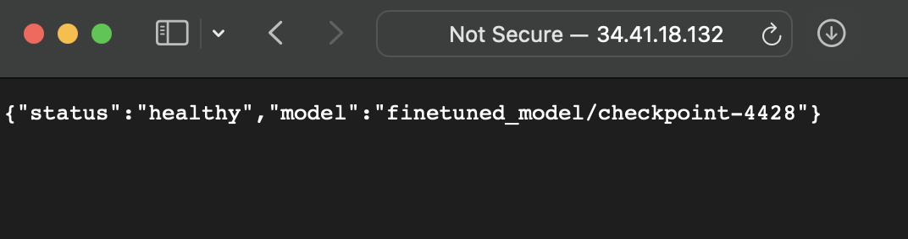
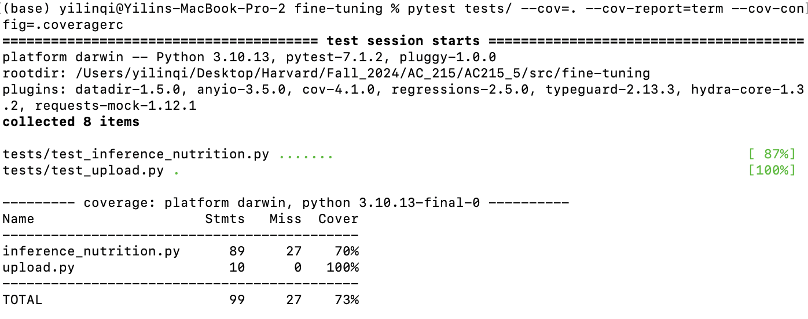

# ByteBites: Recipe Generation


## Project Info
In our project, we aim to develop a web application that integrates LLMs with Nutritional Science and provides a user-friendly interface to personalize recipe suggestions based on available ingredients while providing nutritional insights for the user. 

### Team Members
| Name         | GitHub Profile                   |
|--------------|----------------------------------|
| Grace Guo     | [@gguo78](https://github.com/gguo78) |
| Yilin Qi       | [@yilinnq](https://github.com/yilinnq) |
| Xu Tang   | [@xut806](https://github.com/xut806) |


## Directory Structure

Our repo is structured as follows:

```
├── reports/                 # Application mock-up and interactive prototype
│    ├── logo.png            # [New in MS4] new ByteBites logo
│    ├── logo2.png           # [New in MS4] new ByteBites logo 
│    ├── AC215_webapp_prototype.pdf      
│    ├── Midterm_Presentation.pdf   # Presentation slides PDF version
│    ├── Midterm_Presentation.pptx   # Presentation slides PPTX version  
│    └── prototype_link.md
│    
├── notebooks/               # [New in MS4] In-progress notebooks demonstrating experiments
│    ├── rlaif_peft_finetuned_opt125m.ipynb    # We attempt to implement RLAIF (where the LLM labeler is the off-the-shelf llama-3.1-8b model) on top of our finetuned opt125m model with LoRA
│    
├── src/                     # Source code directory
│    ├── ocr/                # Implementing OCR and NER for ingredient recognition from receipt
│         ├── ocr_ner.py   
│         ├── extract_ingredients.py 
│         ├── docker-shell.sh   
│         ├── docker-entrypoint.sh  
│         ├── Dockerfile   
│         ├── Pipfile   
│         └── Pipfile.lock
│         
│    ├── preprocessing/       #  Preprocessing raw recipe data from a Google Cloud Storage bucket and prepare it for fine-tuning.        
│         ├── data_preprocessing.py    
│         ├── docker-shell.sh   
│         ├── docker-entrypoint.sh  
│         ├── Dockerfile   
│         ├── Pipfile   
│         └── Pipfile.lock
│
│    ├── fine-tuning/             # Fine-tuning LLM using the preprocessed recipe data.
|         ├── inference+nutrition.py  # [New in MS4] Please run this script to get the generated recipe and the nutrition facts   
│         ├── utils.py   
│         ├── fine_tune.py    
│         ├── compare_models.py   
│         ├── docker-shell.sh   
│         ├── docker-entrypoint.sh  
│         ├── Dockerfile   
│         ├── Pipfile   
│         └── Pipfile.lock
│
│    ├── rag/                     # Implementing RAG workflow for generating recipes based on user queries
│         ├── rag.py   
│         ├── docker-shell.sh   
│         ├── docker-entrypoint.sh  
│         ├── Dockerfile   
│         ├── Pipfile   
│         └── Pipfile.lock
│     
│    ├── landing/               # Frontend for the application
│         ├── .env.local        # Secret keys
│         ├── Dockerfile        # Dockerfile for the frontend
│    ├── api-service/          # Backend for the application
│         ├── api/
|         ├── Dockerfile        
│         ├── Pipfile            
│         ├── Pipfile.lock
|         ├── docker-entrypoint.sh
│         ├── docker-shell.sh
│    └── .env
├── .gitignore
├── README.md
├── LICENSE
├── secrets/                      # Secrets directory
│    └── recipe.json
```

Please make sure to create an `.env` file that contains your Huggingface Access Token (`HUGGINGFACE_TOKEN`) and your USDA API key (`USDA_API_KEY`) as well as a `secrets/` directory with your credentials in the location as shown above after cloning the repo.

## Updates 📢
- [NEW IN MS4] Designed new logos for BiteBytes! (Please check out our `reports/` folder)
- [NEW IN MS4] Added finetuned model inference and nutrition facts (Please see [Container 3: Fine-Tuning](#container-3-fine-tuning))
- [NEW IN MS4] Experimenting with RLAIF (Please check out our `notebooks/` folder)
- [NEW IN MS4] Added frontend (Please see [Frontend & Backend](#frontend--backend))
- [NEW IN MS4] Added OCR and NER API (Please see [Frontend & Backend](#frontend--backend))
- [NEW IN MS4] Added CI and testing (Please see [CI & Testing](#ci--testing))
- [NEW IN MS4] Llama-3.2-3b (recipe generator model) finetuned on GCP
- [NEW IN MS4] Llama-3.2-3b deployed and served on GCP (external IP: 34.41.18.132)

## Aplication Design
"Before we start implementing the app we built a detailed design document outlining the application’s architecture. We built a Solution Architecture and Technical Architecture to ensure all our components work together."
---
Here is our Solution Architecture:
 
 
 

Here is our Technical Architecture
 

## Backend API

"We built backend api service using fast API to expose model functionality to the frontend. We also added apis that will help the frontend display some key information about the model and data."
 

  
  
   

## Table of Contents
1. [Virtual Environment Setup & Containers](#virtual-environment-setup--containers)
2. [Data Versioning Strategy](#data-versioning-strategy)
3. [LLM: Fine-tuning](#llm-fine-tuning)
4. [LLM: RAG](#llm-rag)
5. [APIs & Frontend Implementation](#apis--frontend-implementation)
6. [CI & Testing](#ci--testing)


## Virtual Environment Setup & Containers

We have three containers for this project and each container serves a specific purpose within the project, including data preprocessing, fine-tuning, and RAG (Retrieval-Augmented Generation).

### Container 1: OCR & NER (NEW IN MS3)

- **Purpose**: To recognize text from receipt images (OCR) and then recognize edible ingredients (NER).

- **Files**:
  - `Dockerfile`: Defines the environment and dependencies for ocr and ner processing.
  - `Pipfile`: Manages Python packages.
  - `ocr_ner.py`/`extract_ingredients.py`: Two scripts serve the same function and contain the OCR & NER logic. The pre-trained OCR package, `docTR`, is used for text recognition from receipt images, whereas the pre-trained NER model specific to food entities, `InstaFoodRoBERTa-NER` is used for NER. We uploaded the [ExpressExpense](https://expressexpense.com/blog/free-receipt-images-ocr-machine-learning-dataset/) dataset, which is a set of 200 receipt images, to a GCS bucket; this script downloads the data from the GCS bucket and then conducts OCR and NER. It uploads the recognized ingredients as a .json file to the GCS bucket.
  - `docker-entrypoint.sh`: Entry point script for the container.

- **Instructions**:
  - In the `/ocr` directory, run `sh docker-shell.sh` to start the container.
  - Once the container is running, run `python ocr_ner.py` or `python extract_ingredients.py` to start the OCR & NER processing.

### Container 2: Data Preprocessing

- **Purpose**: To process raw recipe data from a Google Cloud Storage bucket and prepare it for fine-tuning and rag tasks. 

- **Files**:
  - `Dockerfile`: Defines the environment and dependencies for data preprocessing.
  - `Pipfile`: Manages Python packages.
  - `data_preprocessing.py`: Contains the preprocessing logic, where we fetch the data from the Google Cloud Storage bucket and upload the processed data to Google Cloud Storage for the next container.
  - `docker-entrypoint.sh`: Entry point script for the container.

- **Instructions**: 
  - In the `/preprocessing` directory, run `sh docker-shell.sh` to start the container.
  - Once the container is running, run `python data_preprocessing.py` to start the data preprocessing.

- **Screenshot**: 

   

### Container 3: Fine-Tuning

- **Purpose**: To fine-tune the language model using the preprocessed recipe data.

- **Files**:
  - `Dockerfile`: Sets up the environment for fine-tuning.
  - `Pipfile`: Manages Python packages.
  - `fine_tune.py`: Contains the fine-tuning logic.
  - `utils.py`: Contains the utility functions for fine-tuning.
  - `upload.py`: Upload the model.safetensors file of the finetuned model to GCP bucket.
  - `docker-entrypoint.sh`: Entry point script for the container.
  - **`inference+nutrition.py`**: Loads the finetuned model using the `model.safetensors` file from the `finetuned_model/` folder on our GCP bucket, generates a recipe with our finetuned model, and obtains the nutrition fact of the recipe by calling the USDA API. The generated recipe is uploaded to the `generated_recipe/` folder on our GCP bucket, and the nutrition facts is uploaded to the `nutrition_facts/` folder on our GCP bucket. An example of the nutrition facts uploaded to our GCP bucket:
      -  
  - `compare_models.py`: Contains the logic to load the finetuned model from the `model.safetensors` file from the GCP bucket, then compare the performance of the fine-tuned model with the base model.

- **Instructions**:
  - In the `/fine-tuning` directory, run `sh docker-shell.sh` to start the container.
  - Once the container is running, run `python fine_tune.py` to start the fine-tuning. You may choose not to run this step, because we have already fine-tuned and copied the model to the container. (However, due to the size of the model, we did not push it to Github.)
  - You can run `python compare_models.py` to compare the performance of the fine-tuned model with the base model.

- **Screenshot**: 

     

### Container 4: RAG (Retrieval-Augmented Generation)

- **Purpose**: To implement the RAG workflow for generating recipes based on user queries.

- **Files**:
  - Dockerfile: Defines the environment for the RAG server.
  - Pipfile: Manages Python packages.
  - rag.py: Contains the RAG implementation.
  - docker-entrypoint.sh: Entry point script for the container.

- **Instructions**:
  - In the `/rag` directory, run `sh docker-shell.sh` to start the container.
  - Once the container is running, run `python rag.py` to start the RAG server and see the results.

- **Screenshot**: 

    

## Data Versioning Strategy

The raw data we used for our project is the [Food.com Recipes and Interactions](https://www.kaggle.com/datasets/shuyangli94/food-com-recipes-and-user-interactions?select=RAW_recipes.csv) dataset on Kaggle. The raw dataset lives on a GCS bucket so that it can be downloaded and preprocessed for our finetuning and rag task. The preprocessed data is also stored on the GCS bucket (please check [Container 1: Data Preprocessing](#container-1-data-preprocessing) for details).

For this milestone, we have adopted the GCS bucket versioning feature for data versioning. In particular, we set the max. number of versions per object to 1 and set the expiration timeframe for noncurrent versions to 7 days. 

## LLM: Fine-tuning

- **Overview**: In this Milestone, we perform fine-tuning on the [`facebook/opt-125m`](https://huggingface.co/facebook/opt-125m) model; [`unsloth/Llama-3.2-3b`](https://huggingface.co/unsloth/Llama-3.2-1B) model.
---
### Fine-Tuning Data

#### For `opt-125m` Model:
- **Dataset**:  
  We fetch the preprocessed dataset `fine_tuning_data_top_5000.jsonl`, which contains **5,000 records**, from the GCS bucket.
- **Data Split**:  
  90% of the fetched dataset is used for training, and 10% is used for validation.
- **Tokenization**:  
  The dataset is tokenized with the following parameters:
  - `max_length=512`
  - `truncation=True`
  - `padding='max_length'`

  Since we are using the `opt-125m` model as a Causal Language Model (CLM), both the recipe prompt and recipe steps are tokenized together as a single input to the model.

#### For `Llama` Model:
- **Dataset**:  
  We fetch the full-sized dataset, `fine_tuning_data.jsonl`, which contains **231,637 records**, from the GCS bucket.
- **Filtering**:  
  The dataset is filtered based on the following criteria:
  - **Prompt length**: ≤ 470 characters.
 <div style="display: flex; justify-content: space-between; align-items: center; gap: 20px;">
  <div style="flex: 1; text-align: center;">
    <p><strong>Before Filtering</strong></p>
    
  </div>
  <div style="flex: 1; text-align: center;">
    <p><strong>After Filtering</strong></p>
    
  </div>
<div style="display: flex; justify-content: space-between; align-items: center; gap: 20px;">
  <div style="flex: 1; text-align: center;">
    <p><strong>Before Filtering</strong></p>
    
  </div>
  <div style="flex: 1; text-align: center;">
    <p><strong>After Filtering</strong></p>
    
  </div>
</div>


  After filtering, the dataset contains **230,197 input-response pairs**.
- **Data Split**:  
  The filtered dataset is split into:
  - **Training set**: 80% of the filtered data.
  - **Validation set**: 20% of the filtered data.

- **Training Data Format**:
  Each record in the training dataset is structured as follows:
  1. **Task-specific instruction**:  
     `"Write a recipe that includes clear instructions and ingredients. Ensure the recipe has a detailed list of ingredients and step-by-step cooking instructions."`
  2. **Input prompt**:  
     The user-provided input to generate a recipe.
  3. **Expected response**:  
     The corresponding recipe, written step by step with detailed instructions.
  4. **EOS token**:  
     An end-of-sequence token appended to signify the end of the output.
---

### Fine-tuning choices
#### For `opt-125m` Model:
We train for 3 epochs with a learning rate of `5e-5`. The specific training parameters used in fine-tuning are as follows:
```
num_train_epochs=3,
per_device_train_batch_size=2,
gradient_accumulation_steps=4,
learning_rate=5e-5,
logging_dir="/app/logs",
logging_steps=10,
save_steps=50,
eval_strategy="steps",
eval_steps=50,
save_total_limit=1,
fp16=False,
max_grad_norm=0.3
```
We did not apply Parameter Efficient Fine-tuning (PEFT) such as LoRA for the fine-tuning task since LoRA works best for larger models, yet the `opt-125m` model is quite small. We plan on implementing LoRA for future milestones when we are able to finetune the model on GCP instead of locally.

#### For `Llama` Model with LoRA:
**Key Features**
- **LoRA-based parameter-efficient fine-tuning**:
  - Only specific low-rank layers are fine-tuned, drastically reducing the number of trainable parameters.
- **Gradient checkpointing**:
  - Reduces GPU memory usage by storing intermediate states during backpropagation.
- **2x faster fine-tuning and inference**:
  - Enabled through Unsloth's advanced optimizations, making the process efficient .
- **Automatic RoPE scaling**:
  - Allows the use of any `max_seq_length` dynamically by implementing Kaiokendev's RoPE scaling method.
- **4-bit quantization**:
  - Memory-efficient model loading using bits-and-bytes (bnb-4bit) quantization.
- **Monitor with W&B**

**LoRA Configurations**
- **Rank (`r`)**: `16`  
- **LoRA Alpha**: `16`  
- **LoRA Dropout**: `0` (dropout is disabled for LoRA layers to retain full training capacity.)
- **Bias**: `"none"`  (no additional bias terms are introduced.)
- **Target Modules**:  
  The LoRA adapters are applied to the following model layers:
  - `q_proj`, `k_proj`, `v_proj`
  - `up_proj`, `down_proj`, `o_proj`
  - `gate_proj`
- **RSLoRA**: Enabled (`use_rslora=True`)  to ensures stability during training by using Robust Scalable LoRA.
- **Gradient Checkpointing**: `"unsloth"`  (enables Unsloth's gradient checkpointing for memory efficiency)

**Hyperparameters and Other Model Configurations**
- **Learning Rate**: `3e-4`
- **Epochs**: `3`
- **Batch Size**: `4` (per device)
- **Optimizer**: `adamw_8bit`  (uses an 8-bit optimizer for efficient memory usage.)
- **Gradient Accumulation Steps**: `4`  (accumulates gradients across multiple steps to reduce memory load.)
- **Warmup Steps**: `10%` of total training steps.

**Finetune Instruction**
- We finetuned Llama use gup on GCP with nvidia-tesla-A100. One can run `/src/fine-tuning/llama/run.py` to initiate the finetuning process.

## LLM: RAG

- **Overview**: In this part, we implement the RAG workflow for generating recipes based on user queries.

- **Dataset**: The same preprocessed data is used for both finetuning task and RAG task. We first load the preprocessed data from the GCS bucket, then further processes and splits them into manageable chunks using `RecursiveCharacterTextSplitter` with `chunk_size=1000` and `chunk_overlap=200`.

- **Model Loading**: We load the `facebook/opt-125m` model with the `opt-125m` tokenizer.

- **RAG choices**: 
  - **Retriever**: We create retriever from the FAISS vector store (`vectorstore.as_retriever()`) and is configured to retrieve a specified number (`k=3`) of top relevant documents.
  The generator is set up through the Hugging Face pipeline (HuggingFacePipeline)
  - **Generator**: We set up the generator through the `HuggingFacePipeline` to generate the recipes based on the user queries.
  - **parameters**: 
    - `max_length=1024` gives a good balance between the length of the generated recipe and the memory usage.
    - `temperature=0.7` adds some randomness to the output without making it too chaotic.
    - `top_p=0.95` filters out less likely tokens.
    - `repetition_penalty=1.2` makes the model less likely to repeat itself.
    - `truncation=True` ensures that the generated text is not cut off abruptly.
    - `return_full_text=False` gives only the newly generated text.
    - `do_sample=True` allows the model to generate text in a more natural and creative way.
- **Example**:
   - query = "Please write a low-sodium meal recipe that takes approximately 55 minutes and includes the following ingredients: tomato, beef. The recipe should be formatted with a clear list of ingredients and cooking instructions."
   - One of the retrieved context: 
   

## APIs & Frontend Implementation

- **Overview**: The The ByteBites application consists of two main components: the frontend and the backend.  
- **Frontend**: This is the user interface of the application, built using Next.js. It includes the landing page and dashboard where users can upload grocery receipts, select ingredients, and generate personalized recipes. The frontend is located in the `landing/` directory. 
- **Backend**: This component handles the OCR & NER tasks as well as the LLM task. It processes uploaded receipt images to extract ingredient information and then generates recipes based on the user's preferences. The backend is located in the `api-service/` directory and is built using FastAPI. 

### Setup Instructions

1. **Docker Compose**: 
   - You can use Docker Compose to set up both the frontend and backend services. Navigate to `src/`, and run the following command to start both services:
     ```bash
     docker-compose up --build
     ```
   - This will start the frontend on port 3000 and the backend on port 9000.

2. **Backend Setup**:
   - Navigate to the `api-service/` directory.
   - Build and run the Docker container using the provided shell script:
     ```bash
     sh docker-shell.sh
     ```
   - The backend service will be available at `http://localhost:9000`. You can access and try out the API endpoints at `http://localhost:9000/docs`.

3. **Frontend Setup**:
   - Navigate to the `landing/` directory.
   - Install the necessary dependencies:
     ```bash
     npm install
     ```
   - Start the development server:
     ```bash
     npm run dev
     ```
   - The frontend application will be available at `http://localhost:3000`.

### Usage Guidelines
- **Landing Page**: Access the landing page at `http://localhost:3000`. Here, you can see a landing page and learn about the features of ByteBites. After logging in, you can navigate to the dashboard.

   

- **Dashboard**: On the dashboard, you can upload a grocery receipt to extract ingredients, select your meal preferences, and generate recipes.

   
  
## Backend Implementation
We deploy and serve Llama on GCP with GPU acceleration (nvidia-tesla-p100) and a REST API interface.
- Below is a screenshot displaying the `health` route with external IP:
  

- Below is a screenshot displaying the `generate` route for generating recipes:
  

## CI & Testing

* note: `ocr-vm` and `llm-vm` folders are excluded because they are work-in-progress directories.

### Testing Tools Used
- **PyTest**: Used for running unit, integration, and system tests.
- **pytest-cov**: Used for generating code coverage reports.
- **Flake8**: Used for linting and code quality checks.

### Implemented Tests
#### Unit Tests
We test each functionality of our backend (in the `api-service` folder), including the `llm.py` router and the `ocr.py` router.
Please see the `test_llm.py` and `test_ocr.py` files in our `api-service/tests` directory. Please see the screenshot below for coverage:
  


We also do an example unit test for one of our deprecated folders: **fine-tuning/**

We test the scripts `upload.py` and `inference_nutrition.py` only for this directory. The `upload.py` uploads our fine-tuned model to GCP, and the `inference_nutrition.py` file does inference with the fine-tuned model as well as generate nutrition facts. We have opted not to include tests for other scripts within this directory, as these scripts are either deprecated or were used exclusively for local fine-tuning tasks, which have already been completed and verified. Please see the screenshot below for coverage:

  

We are not including additional unit tests for other folders for the following reasons:
- **preprocessing/**: Already been completed and verified.
- **rag/**: We eliminated the use of rag in our project.
- **ocr/**: The ocr logic is already included in our backend as a router.
- **landing/**: It is the frontend of our app and only user inputs will be tested.

#### Integration Tests
We test how the different components in `service.py` work together, ensuring that interactions between modules, APIs, and dependencies are functioning correctly.
Please see the `test_service.py` file in our `api-service/tests` directory.

#### System Tests 
We use system tests to validate the behavior of user flow. We use OCR outputs as inputs to the LLM endpoint.
Please see the `test_service.py` file in our `api-service/tests` directory.

### Instructions to Run Tests Locally
1. First, navigate to the container directory you wish to test (e.g., `src/api-service`).
2. Next, run the following commands one by one
   ```
   # ensure `pipenv` is installed: 
   pip install pipenv

   # install dependencies
   pipenv install --dev

   # run the test with coverage report
   pipenv run pytest tests/ --cov=. --cov-report=term --cov-config=.coveragerc
   ```

