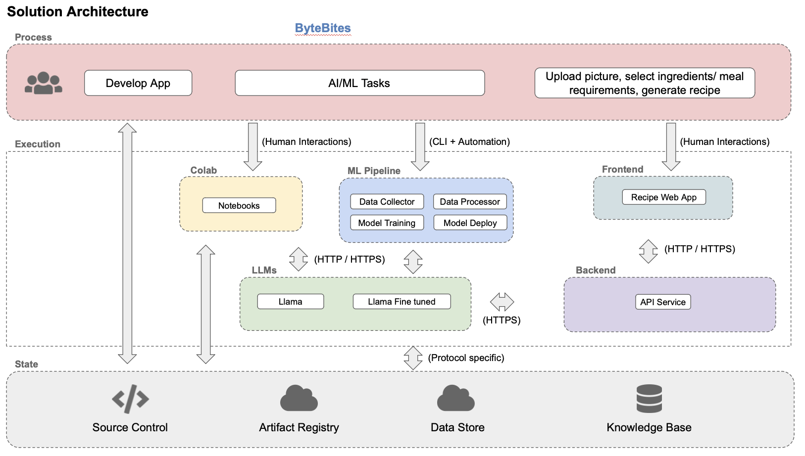
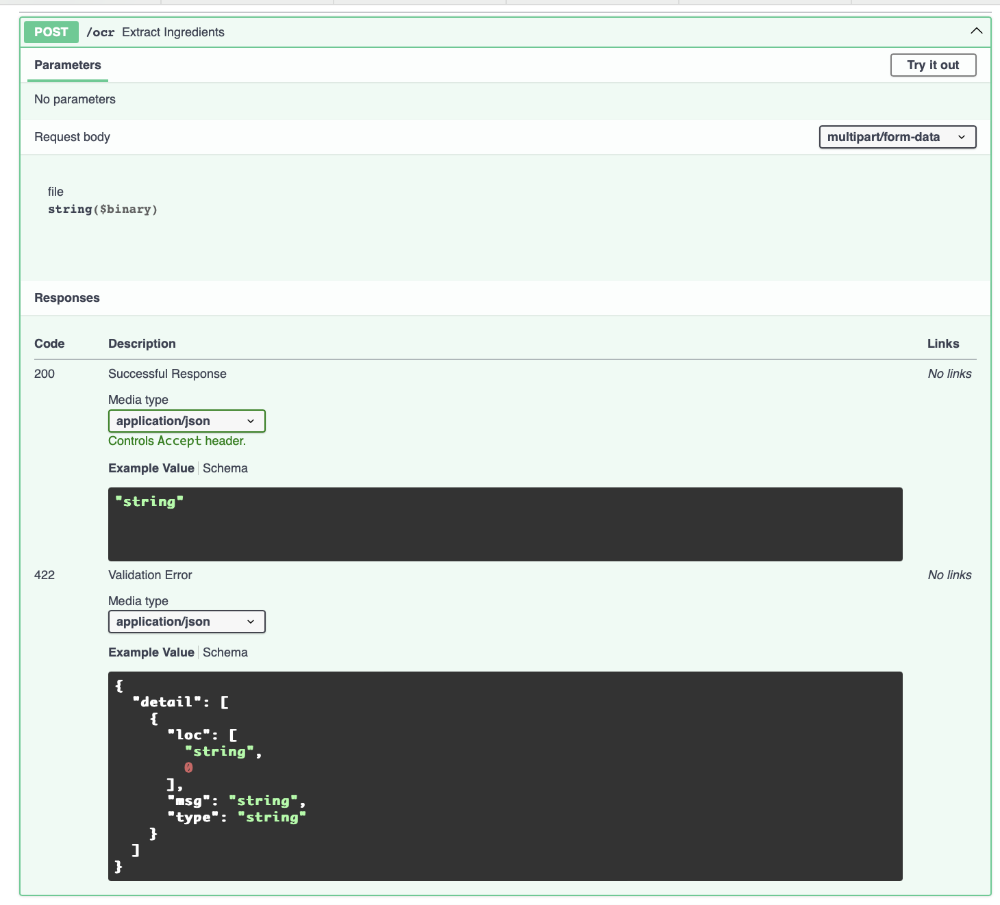
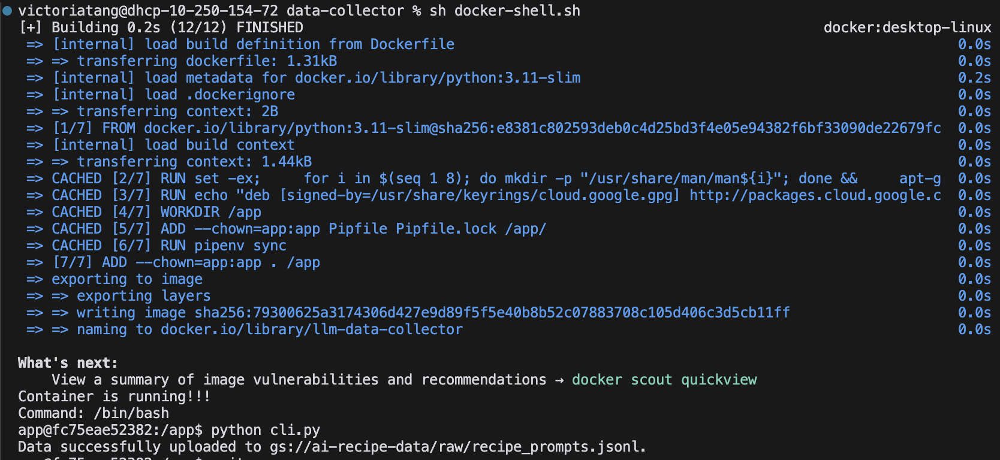
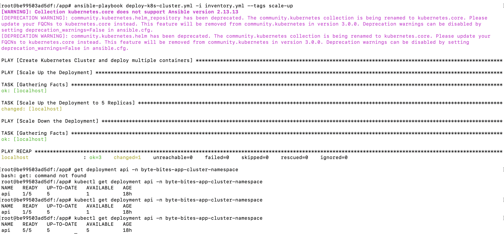

# ByteBites: Recipe Generation


## Project Info
ByteBites is a web application that integrates LLMs with Nutritional Science and provides a user-friendly interface to personalize recipe suggestions based on available ingredients while providing nutritional insights for the user. 

## Project Presentation Video
LINK

## Project Medium Post
LINK

### Team Members
| Name         | GitHub Profile                   |
|--------------|----------------------------------|
| Grace Guo     | [@gguo78](https://github.com/gguo78) |
| Yilin Qi       | [@yilinnq](https://github.com/yilinnq) |
| Xu Tang   | [@xut806](https://github.com/xut806) |


## Directory Structure

Our repo is structured as follows:

```
├── reports/                 # Application mock-up and interactive prototype
│    ├── logo.png            # [New in MS4] new ByteBites logo
│    ├── logo2.png           # [New in MS4] new ByteBites logo 
│    ├── AC215_webapp_prototype.pdf      
│    ├── Midterm_Presentation.pdf   # Presentation slides PDF version
│    ├── Midterm_Presentation.pptx   # Presentation slides PPTX version  
│    └── prototype_link.md
│    
├── notebooks/               # [New in MS4] In-progress notebooks demonstrating experiments
│    ├── rlaif_peft_finetuned_opt125m.ipynb    # We attempt to implement RLAIF (where the LLM labeler is the off-the-shelf llama-3.1-8b model) on top of our finetuned opt125m model with LoRA
│    
├── src/                     # Source code directory
│    ├── deployment/       #  The folder responsible for deployment      
│         ├── nginx-conf/   # The folder storing the nginx configuration 
│         ├── deploy-create-instance.yml   # [Ansible Playbook] creates VM instance (ansible deployment)
│         ├── deploy-docker-images.yml     # [Ansible Playbook] builds and pushes docker containers to GCR AR (ansible deployment & kubernetes deployment)
│         ├── deploy-k8s-cluster.yml       # [Ansible Playbook] deployment with kubernetes with manual scaling options (kubernetes deployment)
│         ├── deploy-k8s-update.sh         # shell script to update kubernetes clusters
│         ├── update-k8s-cluster.yml       # [Ansible Playbook] updates kubernetes clusters
│         ├── deploy-provision-instance.yml  # [Ansible Playbook] provisions VM instance (ansible deployment)
│         ├── deploy-setup-containers.yml   # [Ansible Playbook] sets up docker containers on VM  (ansible deployment)
│         ├── deploy-setup-webserver.yml    # [Ansible Playbook] sets up nginx configuration on VM (ansible deployment)
│         ├── inventory.yml
│         ├── inventory-prod.yml
│         ├── docker-entrypoint.sh
│         ├── docker-shell.sh
│         ├── Dockerfile
│         ├── Pipfile
│         └── Pipfile.lock
│     
│    ├── landing/               # Frontend for the application
│         ├── .env.local        # Secret keys
│         ├── Dockerfile        # Dockerfile for the frontend
│    ├── api-service/          # Backend for the application
│         ├── api/
│             ├── routers/
│             ├── routers/
│             ├── utils/
│             ├── service.py
│         ├── Dockerfile        
│         ├── Pipfile            
│         ├── Pipfile.lock
│         ├── docker-entrypoint.sh
│         ├── docker-shell.sh
│    └── .env
├── .gitignore
├── README.md
├── LICENSE
├── secrets/                      # Secrets directory
```

## Table of Contents
1. [Application Design](#application-design)
2. [Prerequisites and Setup Instructions](#prerequisites-and-setup-instructions)
2. [Deployment Instructions](#deployment-instructions)
3. [Usage Details and Examples](#usage-details-and-examples)
4. [Known Issues and Limitations](#known-issues-and-limitations)


## Application Design

### Solution Architecture
 
 
 

### Technical Architecture
 

### Backend API

We built backend api service using fast API to expose model functionality to the frontend. We also added apis that will help the frontend display some key information about the model and data.
 

 
  
 

#### Backend: ML Workflow
The ML workflow consists of four main stages: **data collection**, **data processing**, **model fine-tuning**, and **model evaluation**. The latter two stages are combined into a single component, where model weights are saved only if the new model outperforms the existing one based on the BLEU evaluation metric. The workflow is automatically triggered when a new dataset JSONL file is uploaded to the data bucket. The trigger script is located at `src/workflow/trigger.py`. The **model deployment** process is managed by the script `src/llm-vm/manage.sh --deploy`, which aligns with practical implementation standards.


Below is the screenshot for workflow trigger:


We also experimented with incorporating the RLHF concept into our project by implementing DPO on top of Llama. The detailed script can be found under `src/RLHF-DPO`. In this approach, we simulate user interaction by having the app generate two recipe responses, allowing the user to select their preferred choice. The prompts, along with the chosen and rejected outputs, are collected to train the DPO model. Note that we did not integrate this component into our workflow due to time constraints.

Below are screenshots of inidividual component's docker container:

* Data Collector
<br>


* Data Processor
<br>


* Model Finetune and Evaluation
<br>


* Model Deployment with Output Generation
<br>


## Prerequisites and Setup Instructions

For replicating our deployment procedure, the following should be ensured:
- You must ensure that you have a `.envlocal` file containing the `NEXT_PUBLIC_CLERK_PUBLISHABLE_KEY` and `CLERK_SECRET_KEY` at the location specied in [Directory Structure](#directory-structure) in order to successfully deploy the frontend container.
- You must ensure the file content in the `secrets/` folder at the location specied in [Directory Structure](#directory-structure):
    - You should have a `usda_api_key.env` file (key to USDA API, in a format like `USDA_API_KEY=...`, without quotation marks surrounding the API key content)
    - You should have a `recipe.json` file (which is the secrets for the GCP account storing the finetuned model safetensors)
    - You should have a `gcp-service.json` file (which is the secrets for the service account `gcp-service` under the same project used for deployment)
    - You should have a `deployment.json` file (which is the secrets for the service account `deployment` under the same project used for deployment; responsible for Ansible deployment).
- You should ensure you have the following service accounts:
    - The service account `deployment` should have the following permissions
        - Compute Admin
        - Compute OS Login
        - Container Registry Service Agent
        - Kubernetes Engine Admin
        - Service Account User
        - Storage Admin
        - Artifact Registry Writer
        - Artifact Registry Reader
    - The service account `gcp-service` should have the following permissions
        - Storage Object Viewer
        - Artifact Registry Reader
- You should create a `gcr.io` repository on GCP Artifact Registry


## Deployment Instructions

### Deployment with Ansible

In this deployment approach, we deploy our web app using **only Ansible playbooks**. This deployment approach does not have Kubernetes and is for demonstration purposes only as requied by Milestone 5. For Kubernetes and Ansible deployment, please see [Deployment With Scaling Using Ansible and Kubernetes](#deployment-with-scaling-using-ansible-and-kubernetes).

#### Setup Instructions

- Navigate to `src/deployment`
- Run `sh docker-shell.sh`
- SSH setup
  - Run `gcloud compute project-info add-metadata --project <YOUR GCP_PROJECT> --metadata enable-oslogin=TRUE`
  - Create SSH key for service account with
    ```
    cd /secrets
    ssh-keygen -f ssh-key-deployment
    cd /app
    ```
  - Providing public SSH keys to instances with `gcloud compute os-login ssh-keys add --key-file=/secrets/ssh-key-deployment.pub`
  - Change details in the `inventory.yml` file
    - Change `ansible_user` to the `username` gotten from the previous command output
    - Change `gcp_service_account_email` to the deployment@<MY_GCP_PROJECT_ID>.iam.gserviceaccount.com
    - Change `gcp_project` to your project id 
    - Change `gcp_region` and `gcp_zone` as needed
- Run `ansible-playbook deploy-docker-images.yml -i inventory.yml`. 
- Run `ansible-playbook deploy-create-instance.yml -i inventory.yml --extra-vars cluster_state=present` which creates the Virtual Machine
- Run `ansible-playbook deploy-provision-instance.yml -i inventory.yml` after changing details in the `inventory.yml` file
  - Change `appserver > hosts` to the external IP address of the VM
- Run `ansible-playbook deploy-setup-containers.yml -i inventory.yml`
- Run `ansible-playbook deploy-setup-webserver.yml -i inventory.yml` after changing details in the `nginx-conf/nginx/nginx.conf` file

**Our web app is deployed with these Ansible playbooks and ready to be viewed at http://34.68.205.67/** (Note: the VM responsible for this deployment approach is currently being stopped to mitigate costs)


### Deployment With Scaling Using Ansible and Kubernetes

In this deployment approach, we deploy our web app using **Kubernetes powered by Ansible playbooks**. We also implement manual scaling up and manual scaling down options.

**Our web app is currently deployed with Kubernetes and ready to be viewed at http://35.226.149.192.sslip.io** (Note: the recipe generation endpoint is currently not callable because we have shut down the VM that is hosting our finetuned llama model. Please see our demo video for the web app in action, with the recipe generation endpoint being callable.)

#### Setup instructions

- Navigate to `src/deployment`
- run `sh docker-shell.sh`
- Run `ansible-playbook deploy-docker-images.yml -i inventory.yml`, which creates and pushes the web app containers to GCP Artifact Registry
- Run `ansible-playbook deploy-k8s-cluster.yml -i inventory.yml --extra-vars cluster_state=present`, which deploys our web app on a Kubernetes cluster with NGINX ingress controller, and sets up the necessary GCP secrets and application credentials, and creates deployments and services for the API and frontend components in the specified namespace.
- You should be able to access the web app at http://<YOUR INGRESS IP>.sslip.io.
* note: if you exit the container and reenter again but kubectl gives a connection error, please run `gcloud container clusters get-credentials byte-bites-app-cluster --zone us-central1-a` to configure the cluster's credentials again.

#### Manual Scaling Up and Scaling Down
We added two separate plays in the `deploy-k8s-cluster.yml` playbook to enable manualing scaling our deployment up and down in order to handle increased or decreased load.
- After deploying as the above, i.e. without running the `deploy-k8s-cluster.yml` playbook with `scale-up` or `scale-down` arguments, we use a default of 1 replica:
    
- When running the `deploy-k8s-cluster.yml` playbook again with `scale-up` argument, 
  ```
  ansible-playbook deploy-k8s-cluster.yml -i inventory.yml --tags scale-up
  ```
  The [Scale Up the Deployment] play will run, and we scale up to 5 replicas:
    
- When running the `deploy-k8s-cluster.yml` playbook again with `scale-down` argument, 
  ```
  ansible-playbook deploy-k8s-cluster.yml -i inventory.yml --tags scale-down
  ```
  The [Scale Down the Deployment] play will run, and we scale down again to 1 replica:
     

### Continuous Integration and Deployment (CI/CD)
We use GitHub Actions to automate test, execute, monitor and deploy our web app. The workflow is defined in `.github/workflows/app-ci-cd-gcp.yml`.
- Make a change to the codebase:
  - Backend code in `src/api-service/` 
  - Frontend code in `src/landing/`.
- Commit and push your changes to the main branch. Your commit message should include `/deploy-app` to trigger the action. 
```bash
   git add .
   git commit -m "/deploy-app <your message>"
   git push origin main   
   ```
- GitHub Actions will automatically test, execute, monitor and deploy the changes. This usually takes 15-20 minutes.
- Visit our website to see the changes: http://35.226.149.192.sslip.io/

## Usage details and Examples

- Nagivate to http://35.226.149.192.sslip.io, you should see the landing page with a get started button: 

- Click on the Get Started button
  - You can sign up with Google or your email if you're a new user.
  - You can also sign in with Google or your email if you're a returning user.
- After signing in, you should see the dashboard:

- You can upload a grocery receipt by clicking on the Upload Receipt button.

- Our app will automatically extract the ingredients from the receipt and display them in the ingredient list. You can also manually add ingredients to the list. Also, you can select the ingredients, your dietary preferences, meal type, and cooking time for the recipe you want to generate. Finally, you can click on the Get Recipe button to generate a recipe.

- Our app will generate a recipe based on users' preferences and you can view the nutrition analysis of the recipe by clicking on the Show Nutrition Analysis button.

- Nutrition analysis of the recipe will be displayed as follows. You can search for the nutrients of interest by typing in the search bar. Also, you can click on the Start Over button to start a new recipe generation.


## Known Issues and Limitations
- Our model deployment component is not integrated directly into the ML workflow due to practical considerations and time constraints. Instead, the deployment is handled separately using the `deploy` function within `src/llm-vm/manage.sh`.
- The recipe generation endpoint is currently not callable on **http://35.226.149.192.sslip.io** because we have shut down the VM that is hosting our finetuned llama model. Please see our demo video for the web app in action, with the recipe generation endpoint being callable. 
- We will be deleting the Kubernetes cluster on Thursday Dec 12 due to incurring costs. This will make our **http://35.226.149.192.sslip.io** 404 not found. Please see our demo video for the web app in action. 